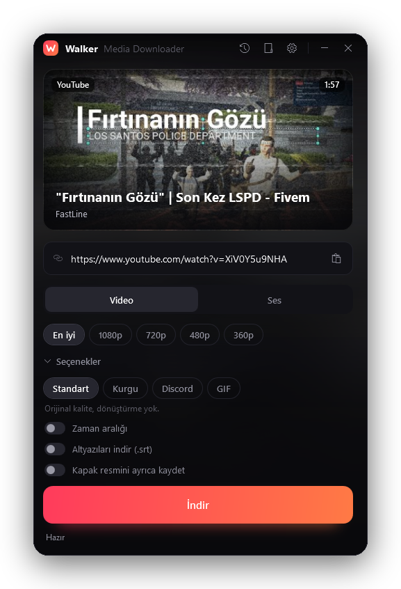

  

<h1 align="center">Walker Media Downloader</h1>

  YouTube, X, Instagram, TikTok ve daha fazlasından video ve ses indirmek için sade bir Windows uygulaması.

  <a href="../../releases/latest"><b>İndir (Windows)</b></a>

---

## Özellikler

**İndirme**
- YouTube, X (Twitter), Instagram, TikTok, Twitch, Reddit, SoundCloud ve Facebook desteği
- Video için 4K'ya kadar kalite, ses için MP3 (128–320 kbps), M4A, FLAC ve WAV
- İndirme kuyruğu: indirme sürerken yeni bağlantılar sıraya eklenir
- Videonun yalnızca belirli bir aralığını indirme
- Playlist ve çoklu videolu gönderiler
- Altyazı (.srt) ve kapak resmi indirme

**Dönüştürme**
- Discord: videoyu 10, 50 veya 500 MB sınırına sığacak şekilde sıkıştırır
- GIF: seçilen aralığı GIF olarak kaydeder
- Kurgu: sabit kare hızlı dışa aktarma, CapCut ve Premiere'de ses kaymadan açılır

**Kullanım kolaylığı**
- Kopyalanan bağlantıları otomatik algılama
- Tarayıcıdan sürükle bırak
- Kapak resimli indirme geçmişi
- İndirme bitince Windows bildirimi
- Uygulama içi otomatik güncelleme
- Türkçe ve İngilizce arayüz

## Kurulum

1. [Releases](../../releases/latest) sayfasından `WalkerMediaDownloader.exe` dosyasını indir.
2. Çalıştır. Kurulum gerekmez.

İlk açılışta gerekli bileşenler (yt-dlp, FFmpeg, Deno) resmi kaynaklarından otomatik olarak indirilir. Bu işlem bağlantı hızına göre bir iki dakika sürebilir. Bileşenler `%LOCALAPPDATA%\Walker\MediaDownloader` klasöründe tutulur ve yt-dlp haftada bir kendini günceller.

> Windows "Bilgisayarınız korundu" uyarısı gösterirse **Ek bilgi → Yine de çalıştır** seçeneğini kullan. Uygulama henüz dijital olarak imzalı olmadığı için bu uyarı çıkar.

> Instagram çoğu içerik için giriş istiyor. Bağlantı okunamazsa **Oturum** bölümünden Instagram hesabının açık olduğu tarayıcıyı seç.

## Gereksinimler

- Windows 10 veya Windows 11 (64-bit)
- .NET Framework 4.8 (Windows 10/11 ile birlikte gelir)

## Kullanım

1. Bir YouTube, X veya Instagram bağlantısı yapıştır. Panoda bağlantı varsa uygulama açılırken otomatik doldurulur.
2. Video ya da Ses seç, kaliteyi belirle.
3. **İndir**'e bas. Dosyalar varsayılan olarak `İndirilenler\Walker` klasörüne kaydedilir; bu klasör uygulamadan değiştirilebilir.

## Üçüncü taraf bileşenler

Walker Media Downloader aşağıdaki açık kaynak araçları kullanır. Bu araçlar uygulamayla birlikte dağıtılmaz, ilk açılışta kendi resmi sürüm sayfalarından indirilir.

| Bileşen | Lisans | Kaynak |
|---|---|---|
| yt-dlp | Unlicense | https://github.com/yt-dlp/yt-dlp |
| FFmpeg | GPL | https://github.com/yt-dlp/FFmpeg-Builds |
| Deno | MIT | https://github.com/denoland/deno |

## Sorumluluk

Bu uygulama yalnızca kişisel kullanım içindir. İndirdiğin içeriklerin telif haklarına ve ilgili platformların kullanım koşullarına uymak senin sorumluluğundadır.

---

© 2026 Walker. Tüm hakları saklıdır.
